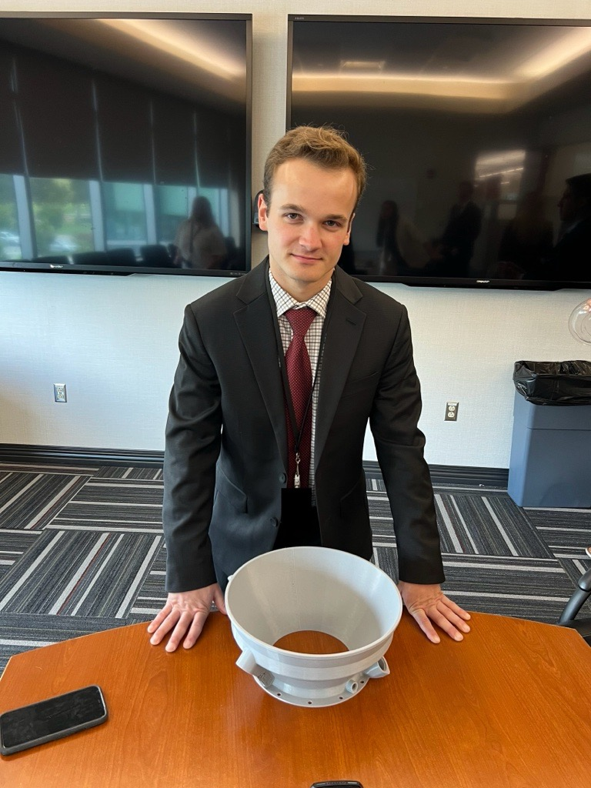

  

    <h1>Isaac Woodward - Robotics & Controls Engineer</h1>
    <h2>Overview</h2>
    
I'm a graduate mechanical engineering student currently pursuing a Master's thesis in robotics and controls at the University of Missouri - Kansas City! I have a strong background in programming (C++/Python/MATLAB), embedded systems, finite element analysis/simulation, control system design, and CAD/3D Modeling. I'm passionate about all things engineering and am always trying to learn new things!

    <h2>Contact Information, Resumes, and Other Links</h2>
    
My Email: isaacbwoodward@gmail.com

    
Phone: 816-206-8312

    
<a href="./assets/pdf/Isaac Woodward Resume - Robotics and Controls.pdf">
      Robotics and Controls Resume (PDF)
    </a>

    
<a href="./assets/pdf/Isaac Woodward Resume - FEA and Simulation.pdf">
      FEA & Simulation Resume (PDF)
    </a>

    
<a href="https://www.linkedin.com/in/isaac-woodward-6213ba261?utm_source=share_via&utm_content=profile&utm_medium=member_ios">
      LinkedIn Profile
    </a>

  

  

# Projects

Below are links to some of my projects:

  <!-- Card 1 -->
  

    

      
      <h3>Motion Platform</h3>
      
A prototype of a wave motion simulation system using a Stewart platform manipulator atop an omni-wheel rover.

    

    <a href="./projects/motion-platform.html">View Project →</a>
  

  <!-- Card 2 -->
  

    

      
      <h3>Kinematic Analysis Program</h3>
      
A MATLAB-based program for analyzing the kinematic performance and workspace of Stewart platform manipulators.

    

    <a href="./projects/kinematic-analysis-program.html">View Project →</a>
  

  <!-- Card 3 -->

  
  

    

      
      <h3>Finite Element Pediatric Knees</h3>
      
Investigating the effect of the adolescent growth plate on ACL strain using finite element models.

    

    <a href="./projects/finite-element-knee-models.html">View Project →</a>
  

  

    

        
        <h3>Nozzle Extension Redesign</h3>
        
Redesigning a rotating detonation rocket engine nozzle extension for additive manufacturing.

      

  
      <a href="./projects/projects/rotating-detonation-rocket-engine-nozzle-extension-redesign.md">View Project →</a>
  

