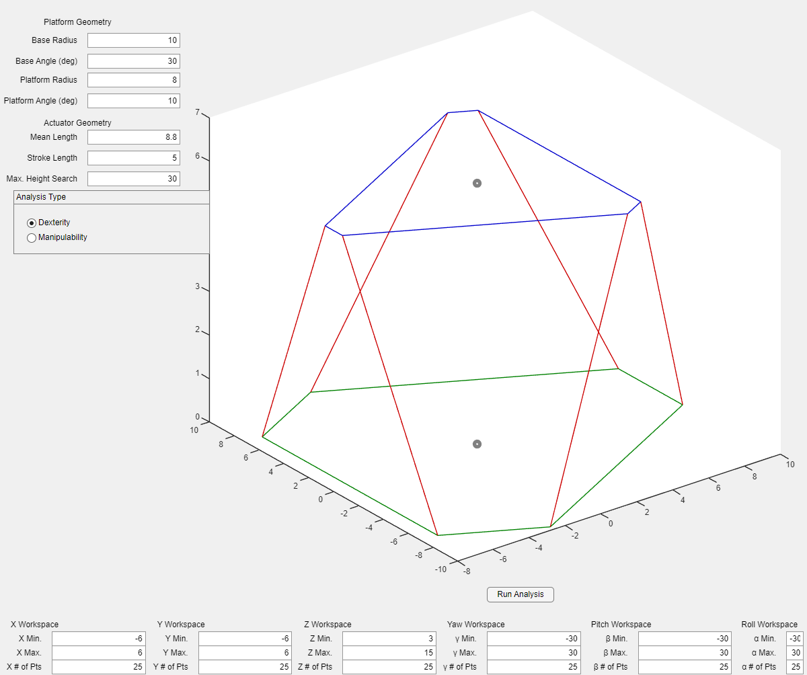
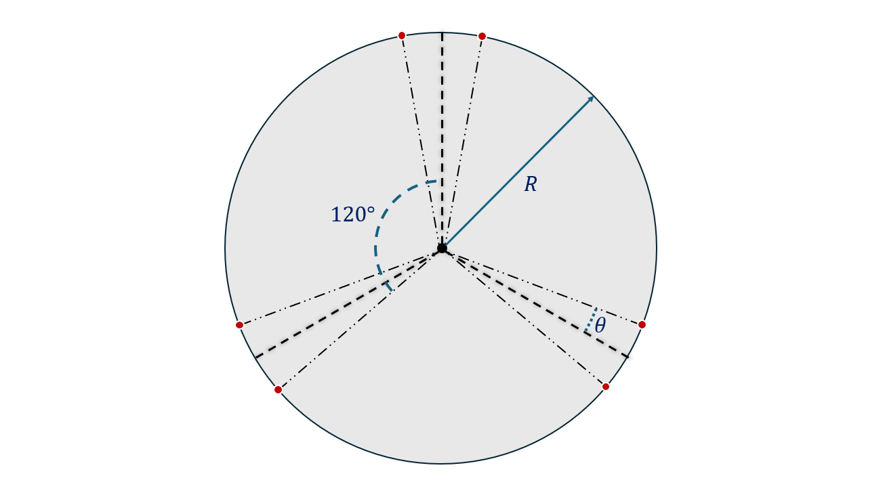
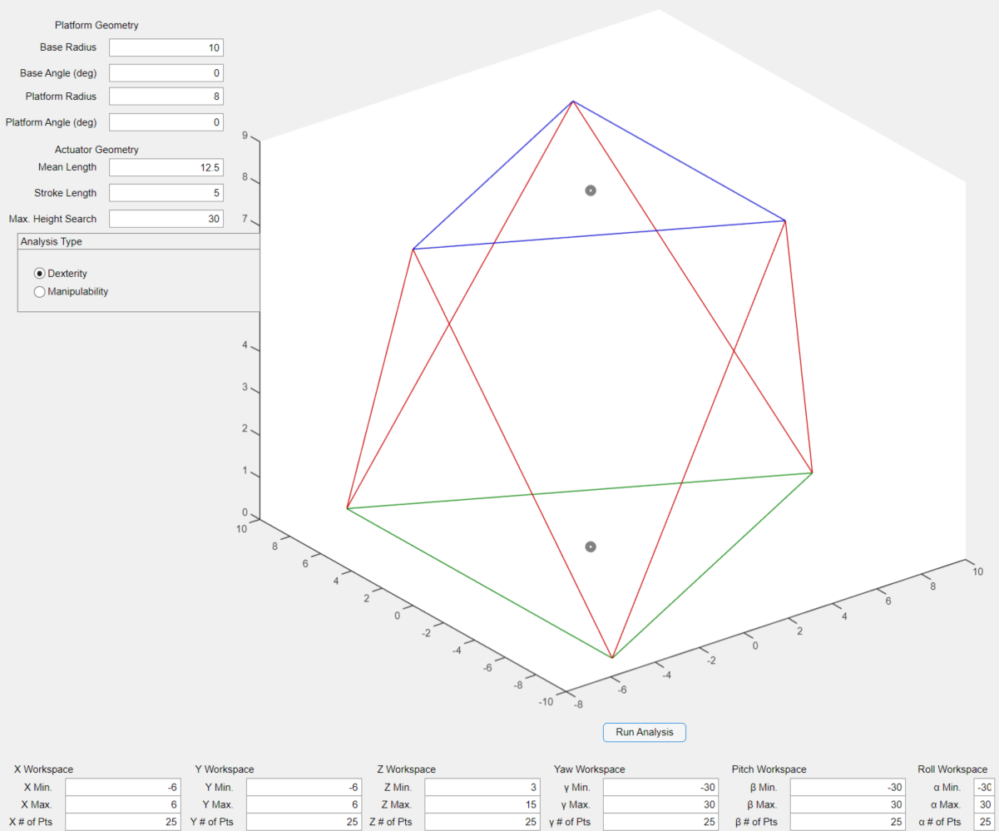
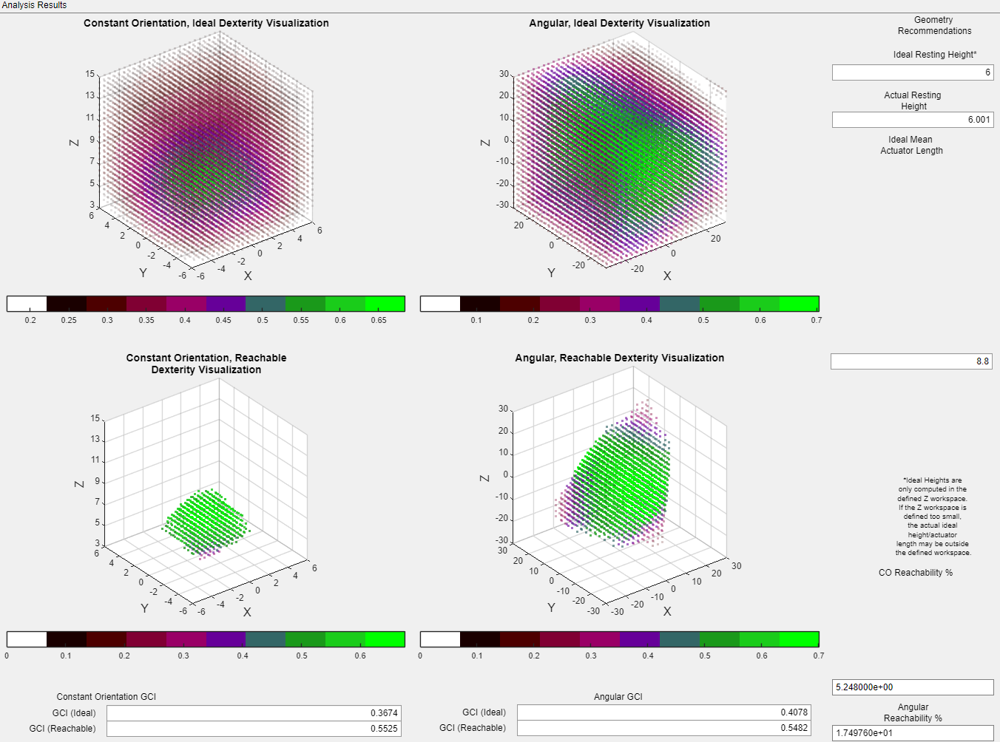

To ensure that I properly designed the geometry of my Stewart platform for my thesis-related work on the motion platform, I created a GUI-based MATLAB app to analyze the workspace and kinematic analysis of a Stewart platform manipulator, simply dubbed the Kinematic Analysis Program (KAP).

I will describe the KAP workflow in more detail during this post, but the GUI is divided into two separate blocks: a setup-focused block, and a results block. First, the setup block is shown below.

To begin with, the setup block allows the user to specify a number of things about 1) the Stewart platform they want to analyze and 2) the type of analysis they want to conduct. First, on the top left of the setup block, the user is given 6 geometric parameters of the Stewart platform they may adjust (the last box, maximum height search, is not a geometric parameter for the platform, and is merely a height used in a pseudo-direct kinematic calculation for determining the "resting height" of the platform, which will be discussed later. For most uses, this parameter does not need to be adjusted from its default value of 30). The first four parameters provided are geometric parameters of the platforms themselves that define how joints for each platform are placed (two parameters exist for both the base and the end-effector platform). The following figure provides a visualization of these geometric parameters.

Stewart platforms consist of two platforms - a base platform and an end-effector platform (often, the end-effector is just referred to as "the platform"). On both the base and the end-effector, joint placements are usually defined by two parameters: a radius and an angular offset. As the previous figure demonstrates, joints are placed in three pairs on a circle of some radius R. The pairs themselves are evenly spaced around the circle with 120 degree offsets. However, joints are usually have some angular offset from their joint pair's centerline. The second parameter, the joint angle, indicates each joint's offset from this centerline. Both the base platform and the end-effector platform's joint placements are governed by these parameters. The base platform's radius and joint offset are simply dubbed the base radius and base angle, while the end-effector platforms' radius and joint offset are called the platform radius and platform angle.

Additionally, the "mean actuator length" and stroke length of actuators are used to define actuator geometry - the "mean" (i.e. halfway extended) actuator length is simply used as it preferable for a Stewart platform to typically operate around this region of mean actuator extension, as this ensures that the platform is not near the edge of its reachable workspace during operation.

Below the geometric parameter definition blocks, the user may select which kinematic performance parameter they wish to use for the given kinematic analysis: dexterity or manipulability. Both of these are commonly used methods of analyzing a robotic manipulator's kinematic performance - dexterity effectively measures the isotropy of available motion of the manipulator in a given position, and manipulability effectively measures the velocity transmissivity of the manipulator in a given position. The program will use one of these two metrics to analyze the platform's performance, but the user may select which one is used.

At the bottom of the setup window, the user may define the workspace over which to analyze the given geometric configuration and the resolution with which to conduct the analysis in each of the 6 degrees of freedom.

Finally, a rough 3D visualization of the given geometric configuration is shown. This visualization automatically updates when any of the geometric parameters are updated. For instance, while the image shown above employed a base angle of 30 degrees and a platform angle of 10 degrees, if the angles are both set to 0, then the visualization updates as follows.

Once a geometric configuration is defined and an analysis is run, then the results window appears. An example of what this results window may look like is shown below. 

The two leftmost plots describe the results of a "constant orientation" analysis - this involves the platform's roll, pitch, and yaw orientation being held constant while the kinematic performance of the platform is computed throughout the workspace that was defined in the setup window. The top left plot is the "ideal" visualization of kinematic performance - this simply indicates what the platform's kinematic performance looks like if actuator restrictions are ignored and is a reference of what kind of performance is possible without actuator restrictions. The bottom left plot displays the results of the "reachable" analysis - for this analysis, only the positions that are actually reachable by the provided actuator geometry are visualized. The combination of these two plots, in addition to some additional metrics provided on the right side of the window, help to give an indication of whether the actuators are properly designed for the given geometric configuration (or vice-versa, in the case of a fixed actuator geometry).

The rightmost plots are similar to the two leftmost plots, in that the top plot is an "ideal" analysis assuming no actuator restrictions while the bottom plot is a "reachable" analysis that accounts for actuator limitations. However, these plots are purely angular analyses - essentially the opposite of the constant orientation analyses. In these angular analyses, first, a pseudo-direct kinematic algorithm is used to compute the position of the platform when all actuators are halfway extended (at their "mean length"). As a note, a pseudo-direct kinematic algorithm that assumes 0 values for all DOF other than heave (height), as a true 6DOF direct kinematic algorithm is extremely challenging to implement for a Stewart platform, and a full 6DOF direct kinematic computation is unnecessary for the purpose of just computing this "resting height" of the platform when all actuators are halfway extended. Once the "resting position" of the platform is computed, the translational position of the platform is held constant as the platform is rotated through the roll, pitch, and yaw workspace, as defined in the setup window. The kinematic performance of the platform is computed from every pose, as was done in the constant-orientation analysis.

On the far right of the analysis results window, a few parameters are provided that aim to provide insight on whether the actuator geometry and platform geometric design are properly aligned. The "resting height" of the platform was already computed during the angular analysis process, and this value is displayed on the right. Additionally, an "ideal resting height" of the given geometric configuration is provided -  this is simply the height at which the platform can achieve the best kinematic performance, and is effectively the ideal height for the platform to operate at. If there is a large mismatch between these two heights, this indicates that the actuator geometry and the geometric configuration are not well-aligned, and the platform is being forced to work in a region where it cannot achieve the best possible kinematic performance. Finally, the ideal mean actuator length is directly computed from the ideal resting height. Once again, if there is a large mismatch between the actual mean length of the given actuators and the ideal mean length, then the user should consider redesigning either the actuator geometry or the platform geometry to better align the actuators and platform geometry to achieve the best possible platform performance.

Finally, at the bottom of the results window, the global average of the chosen kinematic performance parameter is computed and displayed to provide a rough estimate of what kind of kinematic performance can be expected for the chosen geometric configuration. Additionally, in the bottom right, the reachability percentages for both the constant orientation and angular analyses are computed - these reachability percentages represent the percentage of the chosen workspace the platform is capable of reaching with the given actuator and platform geometries.

That's a summary of what the program in its current state does! Future work for the program will involve improving documentation, adding new methods of kinematic analysis that I have seen in the literature, and potentially expanding the functionality of the platform for more general parallel manipulator architectures and allowing for more precise shaping of a platform's workspace. If you'd like to see the code stack, follow the link below:

[View the code on GitHub](https://github.com/iwnmw/Kinematic-Analysis-Program)
