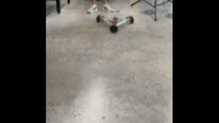

As part of my master's thesis and my work at the Missouri Institute for Defense and Energy, I built a prototype of a motion platform as part of a larger contract with the Navy. The motion platform was a hybrid robotic system consisting of a Stewart platform manipulator mounted on top of a 3DOF, omni wheel kiwi drive rover.

I was responsible for all aspects of this prototype, including the geometric design (which was aided by my kinematic analysis program), the detailed design of joints, frames, etc., the electrical design, embedded systems, and other software. 

The mechanical design process of the Stewart platform involved first determining a set of geometric parameters (base and platform angles, base and platform diameters, and actuator geometry). The actuators were selected before anything else (Actuonix P16-200-20-P actuators were used) and the rest of the platform geometry was designed around these actuators to optimize heave workspace while maintaining reasonable kinematic performance. After that, the detailed design of the Stewart platform was carried out. The main frame components were made from cut 2020 aluminum frames due to their modularity and ease of use/assembly. In a Stewart platform, the 6 joints on the base platform must be universal (U) joints, while the 6 joints on the end-effector platform must be spherical (S) joints. For the U joints, cheap U joints for hobby robotics were simply ordered, and these joints proved to have sufficient range of motion for all platform operation. For the S joints, initially, cheap rod ends for hobby robotics were used, but these proved to have insufficient range of motion for wave motion simulation. To solve these range of motion problem, 3D printed ball joints were created (these were initially employed as a temporary solution, but they worked so well and were so easy to use that I decided to keep them permanently).  The platform itself was made of acrylic with a grid of M5 clearance holes laser cut into it. Finally, a number of smaller 3D-printed joints were designed to connect everything together. The Stewart platform itself, after the mechanical design/fabrication was completed and before any of the electronics were added, is shown below.

The mechanical design of the rover began more on the conceptual design front. The primary requirement the rover had to fulfill was that it had to be capable of 3DOF (surge, sway, and yaw). Two potential design concepts were considered to achieve this. First, a swerve-drive based design was considered, in which 3 separate swerve drives would be used to actuate the rover. Second, an omni wheel kiwi drive configuration was considered, in which 3 omni wheels are used at 120 degree offsets from one another to achieve 3DOF motion. While slightly superior performance could likely be expected from the swerve-drive configuration, preliminary cost analyses suggested the kiwi drive would be nearly an order of magnitude cheaper, so the kiwi drive rover was selected instead. With the kiwi drive design concept selected, the detailed design was conducted similarly to how it was conducted for the Stewart platform. 2020 aluminum frames were used for the primary frame elements, and an acrylic frame with a grid of laser-cut M5 clearance holes was once again used to create a platform for mounting electronics. The Pololu 37D motors had an aluminum bracket that could be used to mount the motors, but an additional 3D printed mounting bracket and some other miscellaneous 3D printed joints were once again created to join all components together. I had an undergraduate assistant, Helena Greim, helping me during the detail design of the rover, so many of the additional 3D printed joints, SolidWorks models, and exact specifications for these components were created by her. The rover, before adding any electronic components, is shown in the following figure.

 # ADD THIS FILE

The electronic components of the Stewart platform were designed first. To ensure ease of long-term use as more and more complex control methodologies were tested on the combined system, a ROS2 environment was set up on a Raspberry Pi which functioned as the brain of the entire system. Inside the ROS2 environment, a set of wave motion simulations that could be run was stored, and a series of nodes were created to slide through the simulations, (eventually) split up the motion between the Stewart platform and rover, perform inverse kinematic calculations on the required motion to convert it from 6DOF platform poses into a series of 6 individual leg lengths for the actuators, and finally, send these leg lengths over a CAN bus to be read by individual microcontrollers, functioning as linear actuator controllers. Seeeduino XIAO microcontrollers were selected to be used as linear actuator controllers as they were commonly used in my lab, are very cheap, and have a very small physical footprint. Simple L298N motor drivers were used to actually drive the linear actuator controllers, and a XIAO was assigned to each actuator pair, so that 3 XIAO microcontrollers read the leg lengths off the CAN bus, read the current position of each of their linear actuators, and then sent the appropriate logic signals to the L298N motor drivers. Initially, a 4S lipo battery was used as a power supply, but a larger battery was sourced long term, as will be seen in later images. The following gif shows early operation of the Stewart platform by itself, before the rover was made. 

Next, the electronic components of the rover were designed. This was relatively simple, since the brain (Raspberry Pi running ROS2) and communication protocol (CAN bus) had already been set up. The Pololu 37D motors used have ready-made motor driver boards that were used for motor drivers, and a single Arduino DUE was used to read the CAN bus for required rover positions, implement a simple feedforward control algorithm to determine rover velocity requirements, and control the motor velocities using a hybrid feedforward/PI feedback control system. Early operation of the rover is shown in the gif below.

The final task was integrating the two systems. This introduced a redundantly actuated control problem: both the Stewart platform and the rover were capable of surge, sway, and yaw actuation, so somehow, the motion in these 3DOF had to be "split up" or "distributed" between the two systems. To begin with, just for the sake of early integration, a simple "control splitting" method was used in which the Stewart platform solely executed heave, roll and pitch motion while the rover executed all surge, sway, and yaw motion. However, future work on the platform involves testing more advanced methods of solving this redundant actuation problem. The following gif shows the first combined motion of the two systems, using the previously described "control splitting" method.

